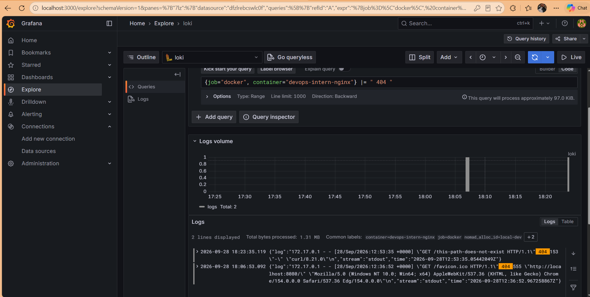

# DevOps Intern Final Assessment

**Name:** Ankit Kumar  
**Submission Date:** 2026-09-28

[](https://github.com/Ankitrepo123/devops-intern-final/actions/workflows/ci.yml)

---

## 1. Project Overview

This project implements an end-to-end DevOps workflow covering:

- Source control with Git and GitHub
- Shell scripting
- Docker containerization
- GitHub Actions CI/CD
- GitHub Container Registry
- HashiCorp Nomad deployment
- Consul service registration
- Loki log aggregation
- Promtail log collection
- Grafana log visualization

The overall flow is:

```text
Source Code
     |
     v
GitHub Repository
     |
     v
GitHub Actions
     |
     +--------------------+
     |                    |
     v                    v
   Lint              Build & Test
                          |
                          v
                  GitHub Container
                     Registry
                          |
                          v
                       Nomad
                          |
                          v
                     NGINX App
                          |
                          v
                      Promtail
                          |
                          v
                        Loki
                          |
                          v
                       Grafana
```

---

# 2. Repository Structure

```text
devops-intern-final/
├── README.md
├── .gitignore
│
├── app/
│   ├── Dockerfile
│   ├── index.html
│   └── nginx.conf
│
├── scripts/
│   ├── sysinfo.sh
│   └── healthcheck.sh
│
├── .github/
│   └── workflows/
│       └── ci.yml
│
├── nomad/
│   └── nginx-app.nomad.hcl
│
├── monitoring/
│   ├── loki-config.yaml
│   ├── promtail-config.yaml
│   ├── docker-compose.yaml
│   └── loki_setup.md
│
└── docs/
    └── screenshots/
```

---

# 3. Prerequisites

The following tools are required:

- Git
- GitHub account
- Docker Desktop
- Docker Desktop configured for Linux containers
- curl
- ShellCheck
- Hadolint
- Nomad
- Consul
- GitHub Container Registry access

Recommended versions:

```text
Docker Desktop: Current stable version
Nomad: 2.x
Consul: Current compatible version
Git: Current stable version
```

---

# 4. Quick Start

## Clone the Repository

```bash
git clone https://github.com/Ankitrepo123/devops-intern-final.git
cd devops-intern-final
```

## Build the Application

```bash
docker build --build-arg BUILD_SHA=local-dev -t devops-intern-final:local ./app
```

## Run the Application

```bash
docker run -d \
  --name devops-intern-nginx \
  -p 8080:8080 \
  devops-intern-final:local
```

## Test the Application

```bash
curl http://localhost:8080/
```

## Test the Health Endpoint

```bash
curl http://localhost:8080/healthz
```

Expected HTTP status:

```text
200 OK
```

## Run the Healthcheck Script

```bash
./scripts/healthcheck.sh http://localhost:8080/healthz
```

Expected output:

```text
Checking application: http://localhost:8080/healthz
Healthcheck passed: HTTP 200
```

---

# 5. Task 1 — Git and Version Control

The project uses Git for source control with incremental commits.

Conventional commit prefixes are used:

- `feat` — new functionality
- `fix` — bug fixes
- `docs` — documentation changes
- `ci` — CI/CD changes

Example commits:

```text
feat: containerize nginx application
feat: add system and application health scripts
ci: add github actions pipeline
feat: add observability stack
docs: complete project documentation
```

## Feature Branch Workflow

Development work is performed using a feature branch.

Example:

```bash
git checkout -b feature/final-documentation
```

The feature branch is pushed to GitHub:

```bash
git push -u origin feature/final-documentation
```

A Pull Request is then created:

```text
feature/final-documentation
            |
            v
          main
```

The Pull Request is reviewed before merging.

## Final Tag

The final submission is tagged:

```bash
git tag v1.0.0
```

Push the tag:

```bash
git push origin v1.0.0
```

---

# 6. Task 2 — System Information and Healthcheck Scripts

The scripts are located in:

```text
scripts/
├── sysinfo.sh
└── healthcheck.sh
```

Both scripts use:

```bash
#!/usr/bin/env bash
set -euo pipefail
```

---

## 6.1 System Information Script

Run:

```bash
./scripts/sysinfo.sh
```

The script reports:

- Current user
- Effective UID
- Hostname
- Kernel release
- ISO-8601 date
- Human-readable disk usage
- Memory information
- Docker daemon status

Example output:

```text
=== System Information ===
Current user: <user>
Effective UID: <uid>
Hostname: <hostname>
Kernel release: <kernel>
System date: <ISO-8601 date>

=== Disk Usage ===
...

=== Memory Usage ===
...

=== Docker Daemon ===
Docker daemon: running
```

---

## 6.2 Application Healthcheck Script

Run:

```bash
./scripts/healthcheck.sh
```

The default target is:

```text
http://localhost:8080
```

A custom target can be supplied:

```bash
./scripts/healthcheck.sh http://localhost:8080/healthz
```

The script:

1. Accepts the target URL as `$1`
2. Defaults to `http://localhost:8080`
3. Performs an HTTP request
4. Checks the HTTP status code
5. Returns exit code `0` only for HTTP `200`
6. Returns a non-zero exit code for failures

Example successful output:

```text
Checking application: http://localhost:8080/healthz
Healthcheck passed: HTTP 200
```

---

# 7. Task 3 — Docker Containerization

The application is based on:

```text
nginx:1.27-alpine
```

The Dockerfile is located at:

```text
app/Dockerfile
```

The NGINX configuration is located at:

```text
app/nginx.conf
```

The application page is located at:

```text
app/index.html
```

---

## 7.1 Build the Image

```bash
docker build \
  --build-arg BUILD_SHA=local-dev \
  -t devops-intern-final:local \
  ./app
```

The `BUILD_SHA` argument is used to inject the build identifier into the application.

---

## 7.2 Run the Container

```bash
docker run -d \
  --name devops-intern-nginx \
  -p 8080:8080 \
  devops-intern-final:local
```

Check the container:

```bash
docker ps
```

---

## 7.3 Test the Application

```bash
curl http://localhost:8080/
```

The application displays:

- Name
- Assessment date
- Build ID

---

## 7.4 Test the Health Endpoint

```bash
curl http://localhost:8080/healthz
```

Expected response:

```text
OK
```

Expected HTTP status:

```text
200
```

---

## 7.5 Container Security

The container is configured to run NGINX as a non-root user.

The Dockerfile also provides:

- Pinned NGINX base image
- `EXPOSE 8080`
- Docker `HEALTHCHECK`
- Custom NGINX configuration
- Build ID injection

---

# 8. Task 4 — GitHub Actions CI/CD

The GitHub Actions workflow is:

```text
.github/workflows/ci.yml
```

The workflow runs on:

- Push to `main`
- Pull Request targeting `main`

Pipeline flow:

```text
Lint
  |
  v
Build
  |
  v
Test
  |
  v
Publish
```

---

## 8.1 Lint Job

The lint job runs:

### ShellCheck

```text
scripts/*.sh
```

### Hadolint

```text
app/Dockerfile
```

This ensures that the shell scripts and Dockerfile pass static analysis.

---

## 8.2 Build Job

The application image is built using the GitHub commit SHA:

```text
BUILD_SHA=${GITHUB_SHA}
```

Equivalent Docker build:

```bash
docker build \
  --build-arg BUILD_SHA="${GITHUB_SHA}" \
  -t devops-intern-final:"${GITHUB_SHA}" \
  ./app
```

---

## 8.3 Test Job

The test job:

1. Builds the Docker image
2. Starts the container
3. Exposes port `8080`
4. Waits for application readiness
5. Runs the healthcheck
6. Fails if the application does not return HTTP `200`

Healthcheck command:

```bash
./scripts/healthcheck.sh http://localhost:8080/healthz
```

---

## 8.4 Publish Job

The publish job runs only when code is pushed to `main`.

Images are published to GitHub Container Registry.

The image name is:

```text
ghcr.io/ankitrepo123/devops-intern-final
```

SHA tag:

```text
ghcr.io/ankitrepo123/devops-intern-final:<commit-sha>
```

Latest tag:

```text
ghcr.io/ankitrepo123/devops-intern-final:latest
```

The workflow uses:

```text
GITHUB_TOKEN
```

for registry authentication.

No long-lived registry credentials are required.

---

## 8.5 CI Badge

The CI status is shown at the top of this README:

```text
[](https://github.com/Ankitrepo123/devops-intern-final/actions/workflows/ci.yml)
```

---

# 9. Task 5 — Nomad Deployment

The Nomad job specification is:

```text
nomad/nginx-app.nomad.hcl
```

The job uses:

```text
Docker driver
```

The image tag is parameterized using the Nomad variable:

```text
image_tag
```

Default value:

```text
latest
```

---

## 9.1 Validate the Nomad Job

```bash
nomad job validate \
  -var="image_tag=latest" \
  nomad/nginx-app.nomad.hcl
```

Expected result:

```text
Job validation successful
```

---

## 9.2 Plan the Job

```bash
nomad job plan \
  -var="image_tag=latest" \
  nomad/nginx-app.nomad.hcl
```

---

## 9.3 Run the Job

```bash
nomad job run \
  -var="image_tag=latest" \
  nomad/nginx-app.nomad.hcl
```

---

## 9.4 Nomad Configuration

The job includes:

- Service job type
- One task group
- One NGINX task
- Docker driver
- 100 MHz CPU
- 64 MB memory
- Dynamic port named `http`
- Container port `8080`

---

## 9.5 Consul Service Registration

The NGINX service is registered with Consul.

Service name:

```text
nginx-app
```

The health check uses:

```text
/healthz
```

Health check interval:

```text
10s
```

Health check timeout:

```text
2s
```

---

## 9.6 Restart and Reschedule

The Nomad job contains restart and reschedule policies.

These provide recovery when the task fails or the allocation needs to be rescheduled.

---

## 9.7 Rolling Update

The update strategy includes:

```text
max_parallel = 1
min_healthy_time = "10s"
healthy_deadline = "2m"
auto_revert = true
```

This provides a controlled rolling update and automatic rollback behavior.

---

## 9.8 Local Nomad Environment Limitation

The Windows Nomad client reported an unhealthy Docker driver when Docker Desktop was running Linux containers.

The application uses the Linux-based:

```text
nginx:1.27-alpine
```

Therefore, the Nomad job requires a Linux-compatible Nomad Docker driver environment for local execution.

The Nomad job specification itself remains configured for the required Docker driver.

---

# 10. Task 6 — Loki Observability

The monitoring stack is located in:

```text
monitoring/
├── loki-config.yaml
├── promtail-config.yaml
├── docker-compose.yaml
└── loki_setup.md
```

The stack consists of:

```text
Docker Logs
     |
     v
 Promtail
     |
     v
   Loki
     |
     v
  Grafana
```

---

## 10.1 Start Monitoring Stack

From the repository root:

```bash
docker compose -f monitoring/docker-compose.yaml up -d
```

Check the services:

```bash
docker compose -f monitoring/docker-compose.yaml ps
```

Expected services:

```text
monitoring-grafana-1
monitoring-loki-1
monitoring-promtail-1
```

---

## 10.2 Loki Readiness

Run:

```bash
curl http://localhost:3100/ready
```

Expected:

```text
ready
```

Loki is exposed on:

```text
http://localhost:3100
```

---

## 10.3 Grafana

Open:

```text
http://localhost:3000
```

Grafana is configured to use Loki as its log data source.

The Loki URL from inside the Docker Compose network is:

```text
http://loki:3100
```

---

## 10.4 Promtail

Promtail collects Docker container logs and sends them to Loki.

The configuration is:

```text
monitoring/promtail-config.yaml
```

The configured labels include:

```text
job
container
service
nomad_alloc_id
```

---

## 10.5 LogQL

Example query for Docker logs:

```logql
{job="docker"}
```

Example query for the NGINX application:

```logql
{job="docker", service="nginx-app"}
```

---

## 10.6 NGINX Non-200 Test

A missing path can be requested using:

```bash
curl -i http://localhost:8080/missing-path
```

Expected HTTP status:

```text
404 Not Found
```

The resulting NGINX access log can be investigated in Grafana Explore using LogQL.

The exact query can depend on the parsed NGINX log fields available in the deployed environment.

---

## 10.7 Monitoring Documentation

Additional monitoring setup information is available in:

```text
monitoring/loki_setup.md
```

This includes:

- Startup instructions
- Promtail labels
- Loki configuration
- LogQL examples
- Troubleshooting information

---

# 11. Task 7 — Documentation

This README provides:

- Project overview
- Architecture
- Prerequisites
- Quick Start
- Git workflow
- Script usage
- Docker build/run instructions
- CI/CD workflow
- GHCR information
- Nomad commands
- Loki/Promtail/Grafana setup
- Troubleshooting
- Known limitations
- Repository structure

---

# 12. Troubleshooting

## 12.1 Nomad Docker Driver Unhealthy

### Problem

The Windows Nomad client reported:

```text
docker    true    false
Docker is configured with Linux containers; switch to Windows Containers
```

### Cause

The Windows Nomad client was attempting to use Docker Desktop's Linux Docker engine.

### Resolution

The application remains configured to use the Linux NGINX image.

A Linux-compatible Nomad Docker driver environment is required for local Nomad execution.

---

## 12.2 NGINX PID Permission Error

### Problem

NGINX initially failed to start because the non-root user could not write the default PID file.

### Resolution

The NGINX configuration was changed to:

```text
pid /tmp/nginx.pid;
```

Temporary NGINX paths were also configured under `/tmp`.

The container can therefore run NGINX as a non-root user.

---

## 12.3 GHCR Repository Name Error

### Problem

GitHub Actions initially generated an image name containing an uppercase repository owner.

Example problem:

```text
ghcr.io/Ankitrepo123/devops-intern-final:<sha>
```

### Resolution

The workflow converts the GitHub repository owner to lowercase before constructing the GHCR image name.

Final format:

```text
ghcr.io/ankitrepo123/devops-intern-final:<sha>
```

---

# 13. Known Limitations

1. Local Nomad execution requires a Linux-compatible Nomad Docker driver environment.
2. Docker Desktop is used for the local container environment.
3. The monitoring configuration is designed around Docker container logs.
4. The Nomad configuration is prepared for Consul service registration.
5. Observability reproduction requires Docker Compose.

---

# 14. Screenshots

Screenshots required for the assessment should be stored under:

```text
docs/screenshots/
```

Recommended screenshots:

```text
docs/screenshots/
├── ci-green.png
├── docker-application.png
├── nomad-plan.png
├── nomad-allocation.png
├── grafana-explore.png
└── github-pr.png
```

## CI Screenshot

Add the GitHub Actions successful workflow screenshot here.

```markdown

```

## Docker Application Screenshot

Add the application/container verification screenshot here.

```markdown

```

## Nomad Screenshot

Add the Nomad validation/plan/allocation screenshot here.

```markdown

```

## Grafana Screenshot

Add the Grafana Explore screenshot here.

```markdown

```

## Pull Request Screenshot

Add the GitHub Pull Request/self-review screenshot here.

```markdown

```

---

# 15. Final Verification

Before creating the final release tag, verify the repository:

```bash
git status
```

Check branches:

```bash
git branch -a
```

Check commit history:

```bash
git log --oneline --decorate --graph -10
```

Check Git tags:

```bash
git tag
```

Verify the final branch is:

```text
main
```

Verify the Pull Request from the `feature/*` branch has been merged.

Verify the GitHub Actions CI badge is green.

Verify the repository is public.

---

# 16. Final Release Tag

After the feature branch has been merged into `main`, create the final tag:

```bash
git checkout main
```

Update local main:

```bash
git pull origin main
```

Create the release tag:

```bash
git tag v1.0.0
```

Push the tag:

```bash
git push origin v1.0.0
```

Verify:

```bash
git tag
```

Expected:

```text
v1.0.0
```

---

# 17. Submission

Final submission:

**Repository:**

https://github.com/Ankitrepo123/devops-intern-final

**Final tag:**

```text
v1.0.0
```

The final repository should contain:

- Public GitHub repository
- Clean Git history
- Conventional commits
- `feature/*` branch merged through Pull Request
- Self-reviewed Pull Request
- Green CI workflow
- Dockerized NGINX application
- GitHub Container Registry configuration
- Nomad job specification
- Loki configuration
- Promtail configuration
- Grafana/observability setup
- README documentation
- Troubleshooting documentation
- Screenshots
- Final `v1.0.0` tag
